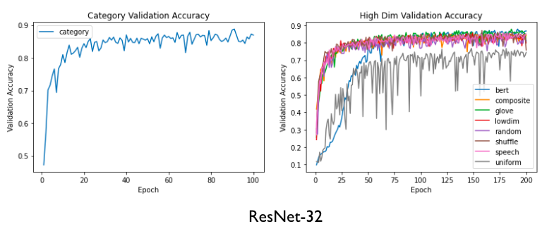
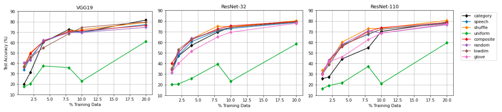
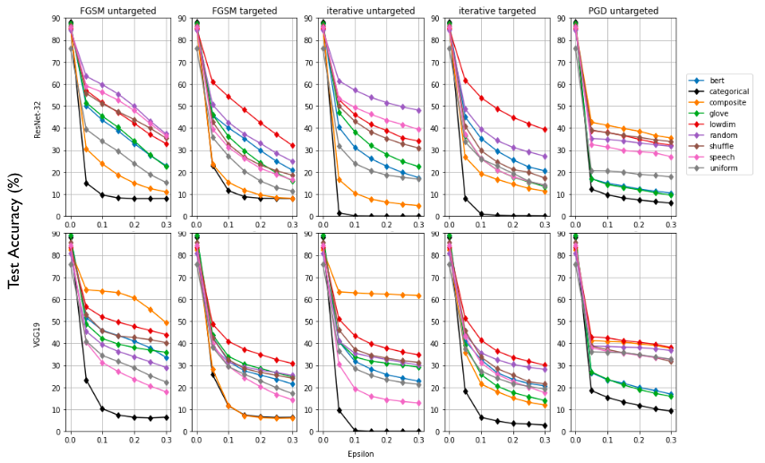
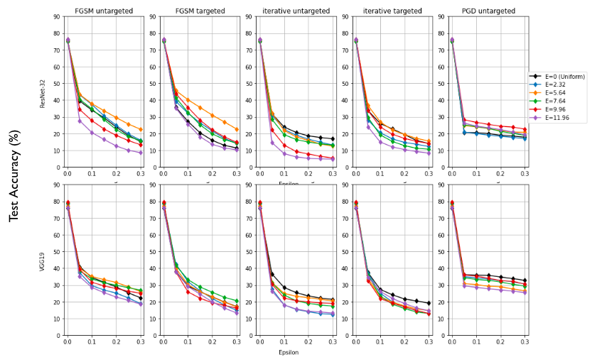
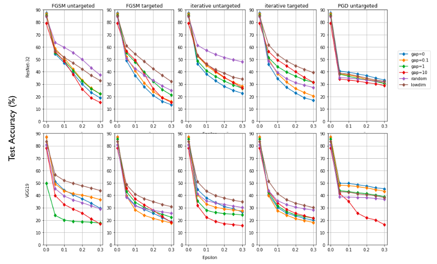

# Creating Image Labels Robust to Adversarial Attacks

## Project Description

This repository contains code and data for a project based on the Chen et al. paper, “Beyond Categorical Label Representations for Image Classification.” Beyond replicating the findings from the original paper that using high dimensional labels can improve a model’s robustness to adversarial attacks as well as its data efficiency, we explore possible explanations for these improvements. Following up on an idea from the paper, we investigate whether high entropy of certain label types may be responsible for their success, but find that this hypothesis is likely inaccurate. We also experiment with an alternative hypothesis, that the degree of overlap between the distributions of values in the high dimensional representations of label classes is responsible for improved robustness. We observe that less overlap results in more robustness and generally labels drawn from the uniform distribution perform better. The reasons behind the unintuitive influence of label representation on model robustness and efficiency remain unclear, and further research is required in order to better understand this phenomenon.

Models used: VGG19, ResNet-32, ResNet-110

Dataset: CIFAR-10

Code Source: https://github.com/BoyuanChen/label_representations (code in this repository is only original code; please see this repo for additional scripts used)

## Repository Description

+ `baseline.ipynb` - Contains a recreation of the results of the Chen et al. paper.
+ `experiments.ipynb` - Contains original experiments related to entropy and overlap.
+ `plots.ipynb` - Figure generation for report.
+ `labels` - Directory of labels used and code used to generate labels
+ `train_attack` - Directory of modified scripts from Chen et al. to run experiments. Please note we did not upload all dependencies, only scripts we modified. Please see Chen et al.'s original repository.
+ `utils` - Directory of utility functions.

## Example commands

## Results

### Baseline Accuracy

+ High dimensional labels achieve a similar accuracy to categorical labels
+ High dimensional labels converge slower (especially Uniform label)

### Data Efficiency

+ Data efficiency improvements is network/depth-specific
+ VGG19: Improvement noticeable at < 4% of training data
+ ResNet-32: Little improvement at any subset of training data
+ ResNet-110: Improvement noticeable at < 10% of training data

### Model Robustness

+ New labels are much more robust than categorical labels
+ Robustness is attack-specific and potentially network-specific
	+ Random labels: strong against untargeted attacks
	+ Composite labels: strong against untargeted attacks (VGG19)
	+ Lowdim labels: strong against most attacks especially targeted

### Investigating Entropy

+ Entropy is likely not the feature that confers robustness to labels

### Beyond Entropy: Overlap between Class Labels

+ Larger gap resulted in more robustness in Iterative Targeted Attacks (ResNet-32)
+ No clear pattern for other attacks
